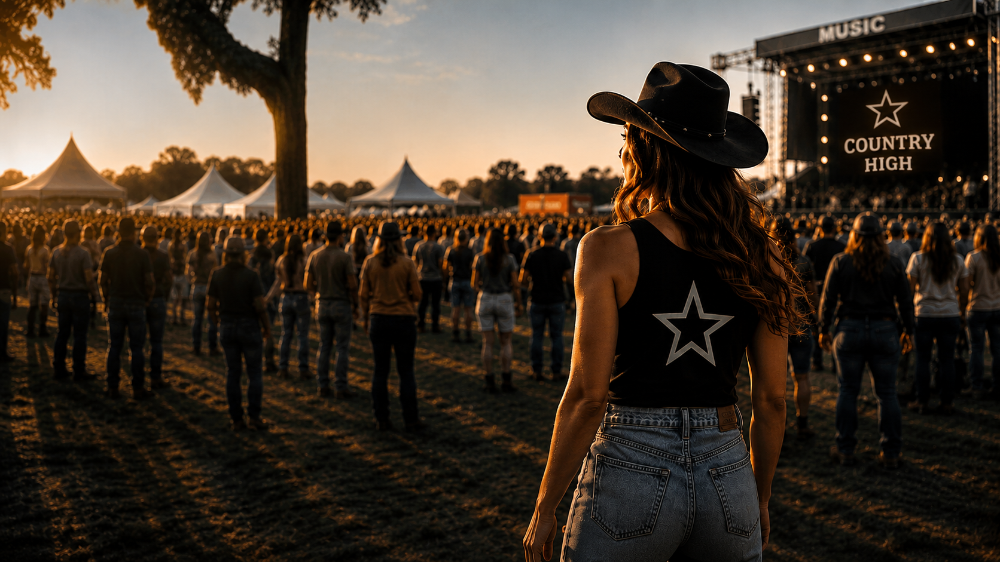
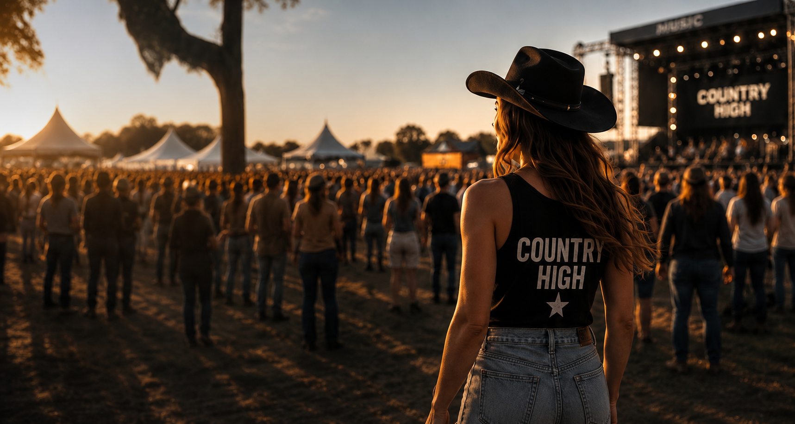
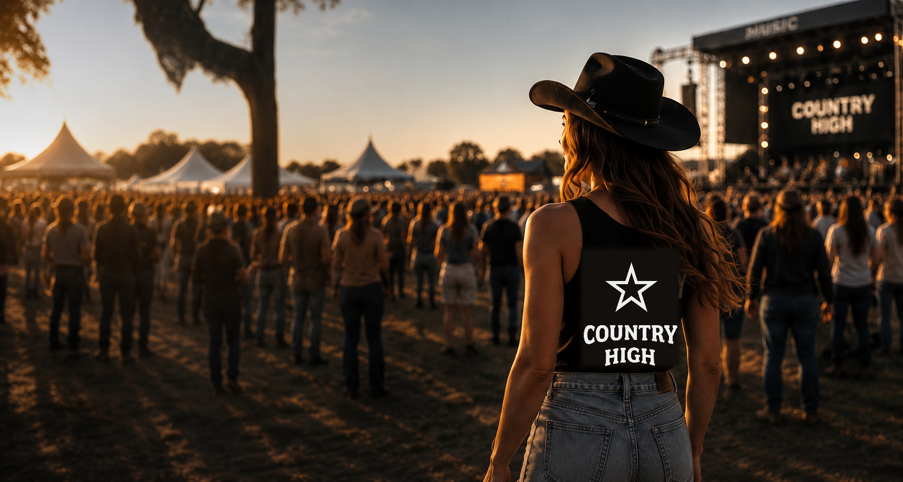
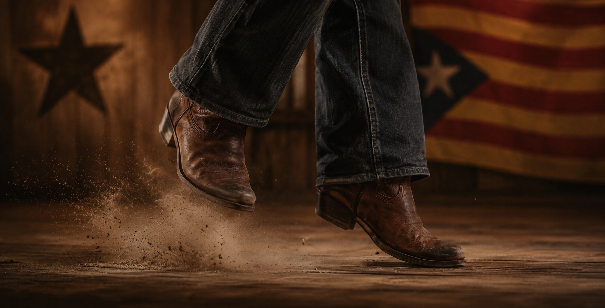
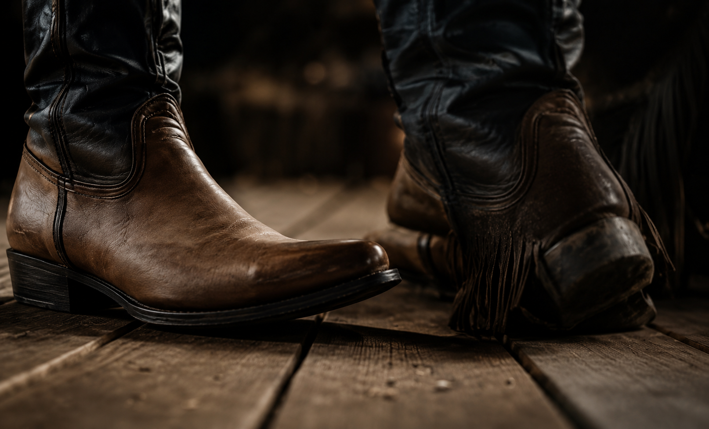
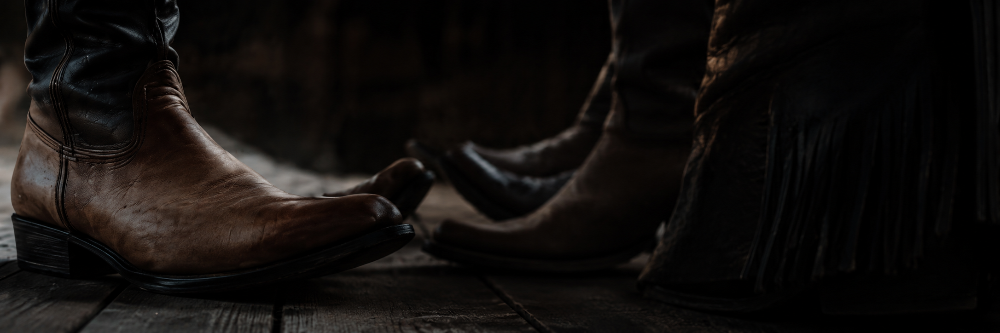
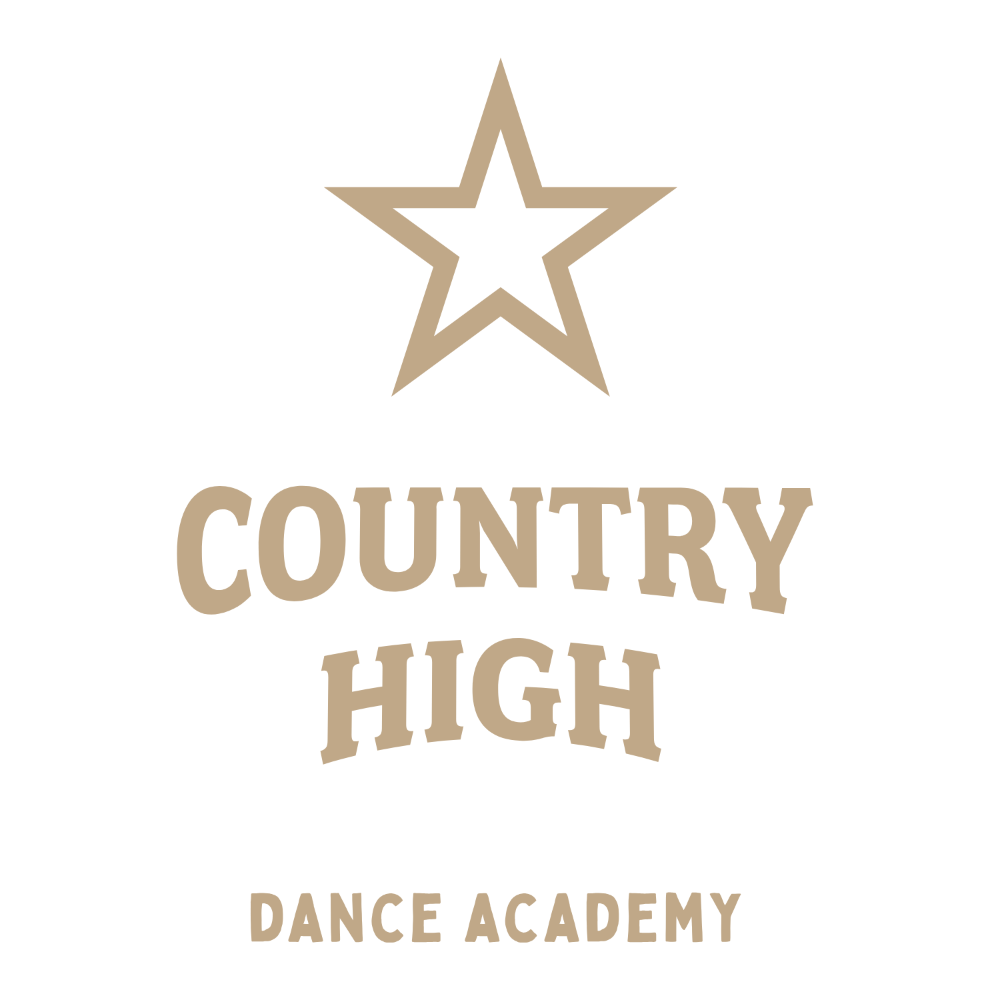
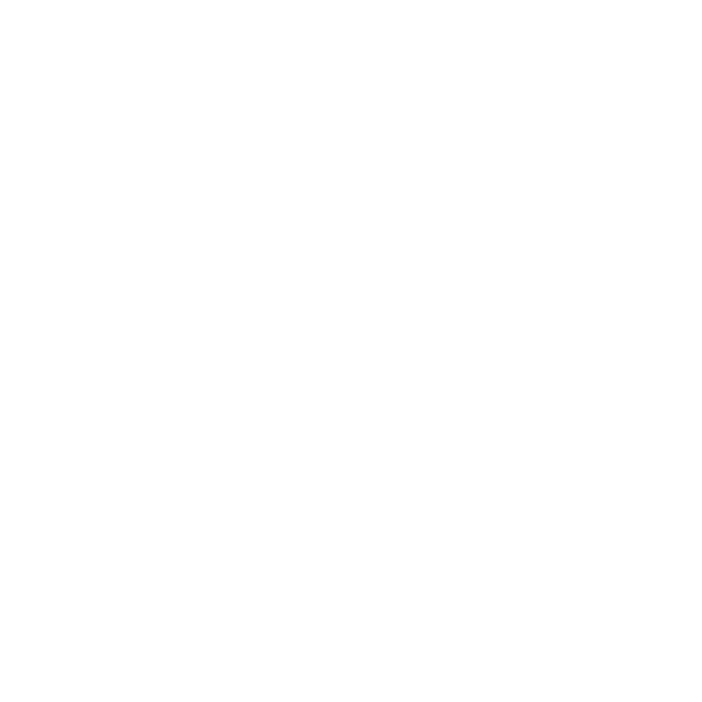
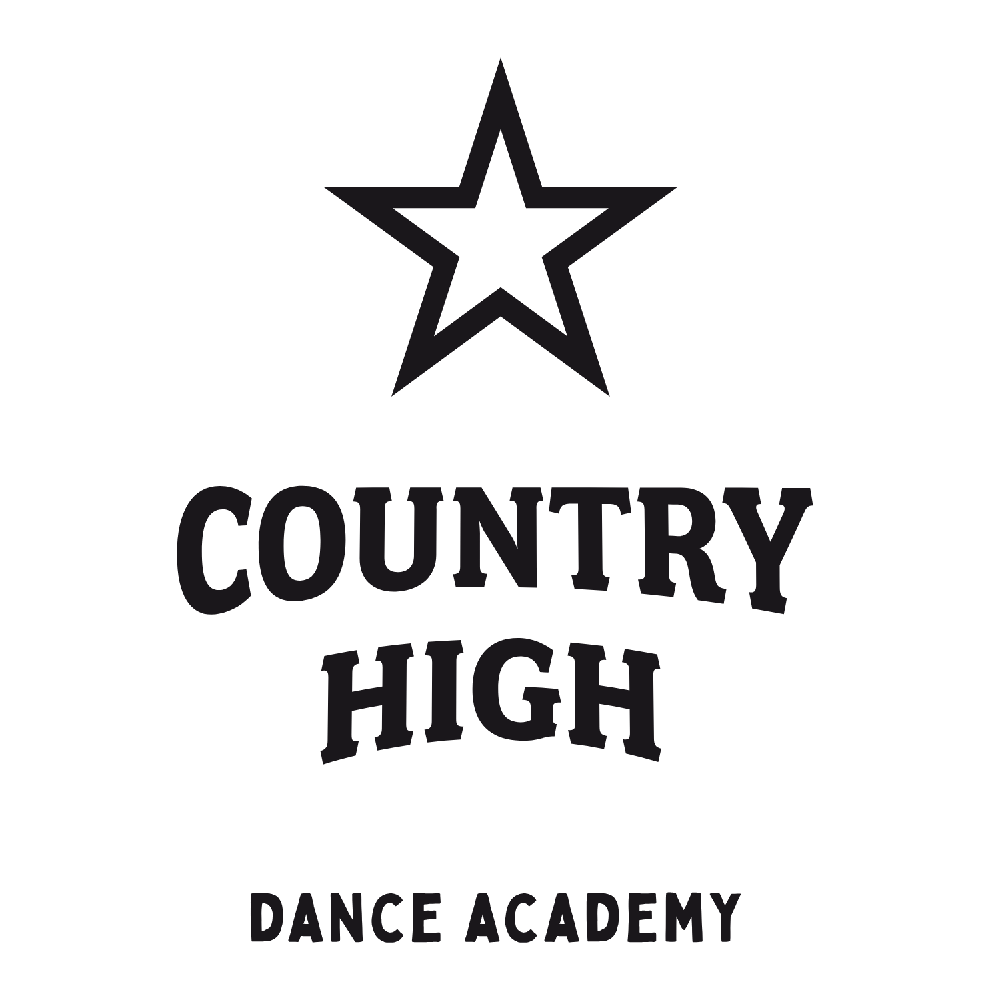
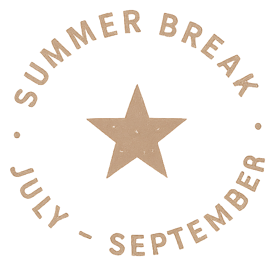

# COUNTRY HIGH — Design Assets

Öffentliche Bild-Ablage für Design-Referenzen (Summer Break Landingpage, Dance Academy Brand).
Alle Dateien sind per Direkt-URL erreichbar — z. B. um sie einer Claude-Design-Session als Referenz zu geben.

**URL-Schema:**
```
https://raw.githubusercontent.com/ryterkim/ch-design-assets/main/assets/<dateiname>
```

## Heroes & Styles

| Vorschau | Datei |
|---|---|
|  | `hero-summerbreak.png` |
|  | `hero-festival.png` |
|  | `hero-festival-logo.png` |
|  | `style-catalan.png` |
|  | `style-modern.png` |
|  | `style-traditional.png` |
|  | `community-boots.png` |

## Logos & Badges

| Vorschau | Datei |
|---|---|
|  | `logo-danceacademy-white.png` |
|  | `logo-danceacademy-beige.png` |
|  | `logo-danceacademy-white-stacked.png` |
|  | `logo-danceacademy-black-stacked.png` |
|  | `summer-break-badge.png` |

## Icons & Sterne

`icon-star-*.png`, `community-star-beige.png`, `icon-barchart-beige.svg`, `icon-book-beige.svg`, `icon-laptop-beige.svg`

## Font

`bobby-jones-soft.ttf`
